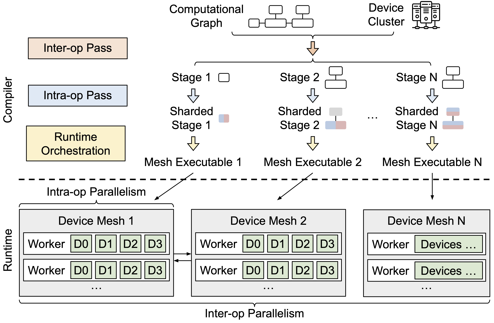

### 一、mindspore 套件
- 1、核心组件：
  - （1）MindSpore： 核心框架
  - （2）MindSpore Lite： 简单框架
  - （3）MindSpore AKGL: 算子融合加速
- 2、通用工具组件：
  - (1）serving:  推理服务器 
  - (2) mind-golden-stick: 模型压缩 （在大模型的效果）
  - (3) federated： 联邦学习
  - (4) mindarmour: 安全与隐私 
  - (5) mindrl: 强化学习
- 3、大模型套件：
  - （1）mindformers: 类似于transformers的功能和接口，包括：
    - AutoClass
    - Trainer
    - Pipeline （推理，Mindspore Lite,增量推理，流式推理，分布式推理，
        当前Inference模块仅支持LLM模型的生成式任务，与Serving得关系）
    - Parallel
    - PET (在MindPET之上实现,LoRA,Prefix-Tuning, P-Tuning, Prompt-Tuning)
    - 断点续训
    - Profiler
  - （2）mindPet： 低参数微调套件
- 4、应用套件：研发的开源工具箱,提供大量经典模型和SoTA模型以及它们的预训练权重和训练策略。 
  - (1) mindcv
  - (2) mindaudio
  - (3) mindnlp
  - (4) mindocr

### 二、Ascend 套件  
- 1、transformers: 对npu得支持实现在原生transformers中
  - （1）单NPU
  - （2）多NPU (一个节点)
  - （3）FP16混合精度
  - （4）Pytorch FSDP (试验中)
  -  (5) 还不支持DeepSpeed
  - （6）还不支持大模型推理
- 2、DeepSpeed: 目前仅支持 deepspeed 版本 0.9.2
- 3、Megatron-LM: 针对Megatron-LM的适配
- 4、Apex: 针对Apex的适配
- 5、AsendSpeed: 同时依赖Megatron和DeepSpeed，像是这两个的结合适配。支持：  
  - Data Processing
  - Fine-Tuning
  - Inference
  - Evaluation
  有点nemo的意思，除了没有使用hydra做配置
- 6、att: Ascend 训练工具链,包括基于命令行的性能工具、精度工具、分析迁移工具,以及tensorboard的插件
- 7、ait: Ascend 的推理工具，包括benchmark,debug,analyze,convert,profile

### Nemo 

### HuggingFace 

### Ray

### Alpa: 一个完全依赖ray的框架，依赖jax和XLA，含训练和推理能力。支持：
   数据并行、算子并行、流水线并行，以及自动并行。挺有意思的一个框架。

### ColossalAI: 
  也是ray生态的一员。在推理用了ray。

### trlx
  训练和推理框架。集成了Huggingface的 accelerate和nvidia的nemo。还有一个基于ray的实现。