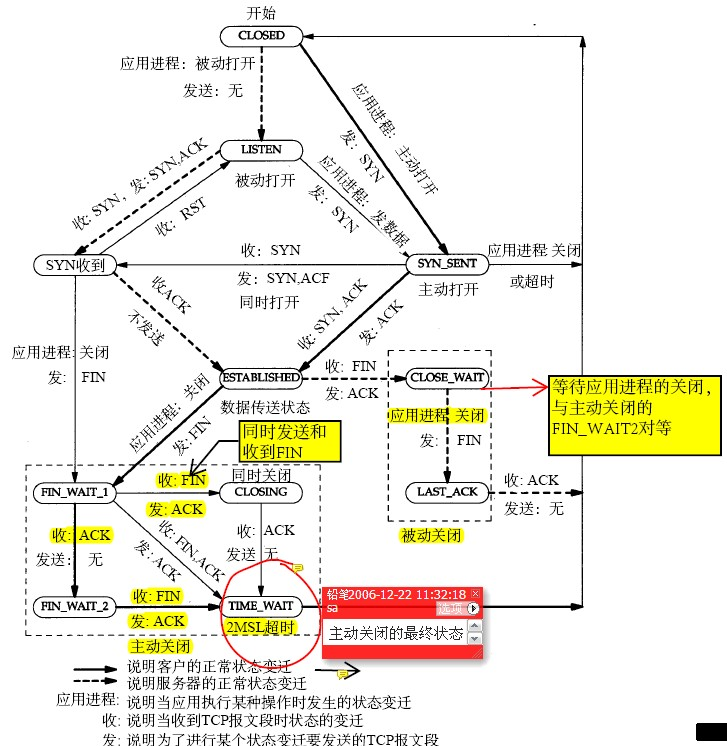

## 深入浅出TCP之半关闭与CLOSE_WAIT

终止一个连接要经过4次握手。这由TCP的半关闭（half-close）造成的。既然一个TCP连接是全双工（即数据在两个方向上能同时传递，可理解为两个方向相反的独立通道），因此每个方向必须单独地进行关闭。这原则就是当一方完成它的数据发送任务后就能发送一个FIN来终止这个方向连接。当一端收到一个FIN，内核让read返回0来通知应用层另一端已经终止了向本端的数据传送。发送FIN通常是应用层对socket进行关闭的结果。

例如：TCP客户端发送一个FIN，用来关闭从客户到服务器的数据传送。

    半关闭对服务器究竟有什么影响呢？先看看下面的TCP状态转化图

